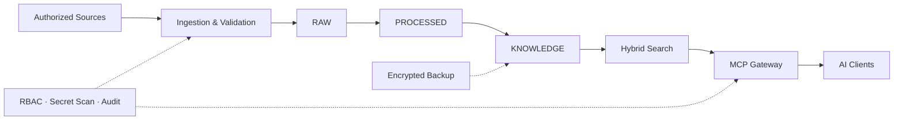

# ACheng AI Vault — Showcase

> 一个隐私优先的个人 AI 知识库：把分散资料整理为可检索、可追溯、可控权限的数据底座。

这是生产项目的**脱敏公开展示版**。真实个人数据、密钥、云端项目标识、私有路径与完整生产配置均不在此仓库中。

## 项目目标

不同 AI 助手通常各自保存上下文，资料也分散在笔记、云盘和历史对话中。本项目建立统一的数据层，让多个 AI 在明确权限边界内检索和写入知识，同时保留来源、版本与审计能力。

## 核心能力

- **三层数据模型**：RAW 原始材料 → PROCESSED 清洗分段 → KNOWLEDGE 已确认知识
- **混合检索**：PostgreSQL 全文检索 + pgvector 语义检索；语义服务不可用时自动降级
- **MCP 接入**：为不同 AI 分配最小权限角色，区分读取、采集、维护等能力
- **安全写入**：敏感信息检测、字段白名单、参数化查询与重复内容幂等处理
- **可恢复数据治理**：软归档、版本历史、加密备份与隔离恢复演练
- **多来源索引**：笔记、云盘文件元数据、对话导出及其他授权来源

## 架构概览



## 权限设计

| 角色 | 允许操作 | 明确禁止 |
|---|---|---|
| Reader | 搜索、读取来源引用 | 写入、删除 |
| Collector | 新增经过校验的采集内容 | 读取全库、修改历史 |
| Assistant | 读取、新增、更新、关联、软归档 | 永久删除 |
| Maintainer | 系统维护、备份与恢复演练 | 绕过审计 |

权限在应用入口与数据库入口双重校验。任何角色都不提供永久删除工具。

## 技术栈

- Python
- PostgreSQL / Supabase
- pgvector
- MCP (Model Context Protocol)
- SQLite（本地验证与降级）
- 本地 Embedding 模型

## 脱敏策略

本公开仓库不会包含：

- 个人文档、对话正文、财务或身份数据
- API Key、Token、密码、验证码、私钥或完整连接串
- Supabase 项目 ID、生产数据库地址或 service role key
- Google Drive 文件 ID、目录结构或真实同步清单
- 本机绝对路径、账号标识、备份密钥或运行日志

公开示例只使用虚构数据和占位配置，并与生产环境完全隔离。

## 安全写入示例

```python
from dataclasses import dataclass

FORBIDDEN_FIELDS = {"password", "api_key", "token", "private_key"}

@dataclass(frozen=True)
class DocumentInput:
    title: str
    content: str
    source_type: str


def validate_payload(payload: dict) -> DocumentInput:
    blocked = FORBIDDEN_FIELDS.intersection(key.lower() for key in payload)
    if blocked:
        raise ValueError(f"Sensitive fields are not accepted: {sorted(blocked)}")
    return DocumentInput(
        title=str(payload["title"]).strip(),
        content=str(payload["content"]).strip(),
        source_type=str(payload.get("source_type", "demo")),
    )
```

## 我负责的工作

- 从需求到数据模型、权限边界和可恢复策略的整体设计
- Python 数据管道与 MCP 服务实现
- PostgreSQL / pgvector 检索与迁移设计
- 多 AI 客户端的角色隔离、审计与秘密信息防护
- 本地管理界面、自动维护、备份和恢复验证

## 说明

本仓库用于展示工程思路与经过脱敏的实现片段，不是生产数据仓库。后续会逐步补充独立可运行的最小示例、测试和界面截图。
